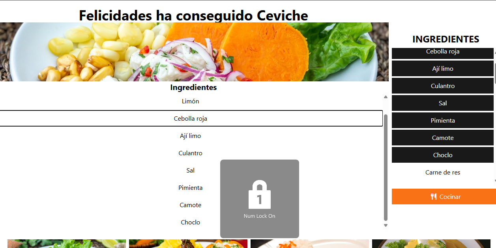

# COCINA

Instalacion

```bash
npm install
```

Ejecutar

```
npm run dev
npm run serve


```
```bash
#xampp
npm run serve
npm run build
# despues de npm run build
#EN ./dist/ el html /cambiar a localhost/cocina/dist/assets/...css tambien al js 
#Es necesario tener node js instalado https://nodejs.org/en
```

